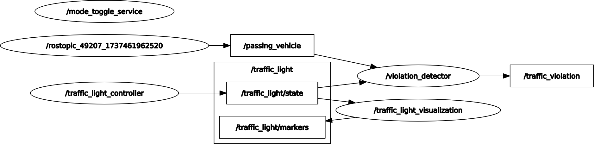

# Traffic Light Controller (ROS)

This project is a ROS-based traffic light controller system. It includes nodes for controlling traffic lights, handling pedestrian crossing requests, and visualizing the traffic light states in RViz.

## Dependencies

- ROS Noetic
- Python 3
- RViz

This project can be run in a devcontainer using the provided files in the `.devcontainer` directory. To use the devcontainer, you need to have Docker installed on your machine and can open the project in Visual Studio Code with the Remote - Containers extension. Then you can press `F1` and select `Remote-Containers: Reopen in Container` to open the project in the devcontainer.

## Quick Start

Clone the repository

```sh
git clone https://github.com/niklashempel/traffic-light
cd traffic-light
```

Build the project

```sh
catkin_make
```

Source the setup file

```sh
source devel/setup.bash
```

Run the project

```sh
roslaunch controller start.launch
```

## Nodes

The graph shows how the different nodes and topics work together:


Below are some details about the different nodes.

### Traffic Light Controller

The traffic light controller node is responsible for controlling the traffic lights. It iterates through the defined states and publishes the current state to the `/traffic_light/state` topic.

At the same time, the node implements a service `/pedestrian_crossing` that can be called to request a pedestrian crossing. The traffic light controller will then switch to the pedestrian crossing state and back to the normal state after.

The service request can be found under [src/controller/srv/PedestrianCrossing.srv](src/controller/srv/PedestrianCrossing.srv).

### Mode Toggle Service

The mode toggle service node implements a service `/toggle_mode` that can be called to toggle the mode of the traffic light controller between day and night mode. During night, the traffic light for one direction will be turned off and the other direction will have a blinking yellow light.

The service request can be found under [src/controller/srv/ToggleMode.srv](src/controller/srv/ToggleMode.srv).

### Violation detector

The violation detector node subscribes to the `/traffic_light/state` and `/passing_vehicle` topics and checks for violations. It will publish a possible violation to the `/traffic_violation` topic.

## Parameters

- `~day_mode/states` (list): States for day mode.
- `~day_mode/durations` (list): Durations for day mode.
- `~night_mode/states` (list): States for night mode.
- `~night_mode/durations` (list): Durations for night mode.
- `~pedestrian_crossing_north_south/states` (list): States for north-south pedestrian crossing.
- `~pedestrian_crossing_north_south/durations` (list): Durations for north-south pedestrian crossing.
- `~pedestrian_crossing_east_west/states` (list): States for east-west pedestrian crossing.
- `~pedestrian_crossing_east_west/durations` (list): Durations for east-west pedestrian crossing.
- `/traffic_light/current_mode` (str): Current mode of the traffic light controller (Day or Night).
- `~default_mode` (str): Default mode of the mode toggle service.

## Messages

`TrafficLightState.msg`:

- `direction`: Direction of the traffic light (North-South or East-West).
- `state`: State of the traffic light (Red, Yellow, Green, or Black).
- `duration`: Duration of the state in seconds.

`PassingVehicle.msg`:

- `location`: Location of the vehicle (North, East, South, West)
- `is_passing`: Whether the vehicle is passing the intersection.

`TrafficViolation.msg`:

- `location`: Location of the violation (North, East, South, West)
- `violation_detected`: Whether a violation was detected.
- `timestamp`: Timestamp of the violation.

## Useful commands

Change to night mode

```sh
rosservice call toggle_mode "mode: 'Night'"
```

Trigger pedestrian crossing

```sh
rosservice call pedestrian_crossing "direction: 'North-South'"
```

Simulate an incoming vehicle

```sh
rostopic pub /passing_vehicle controller/PassingVehicle "location: North
is_passing: true"
```
